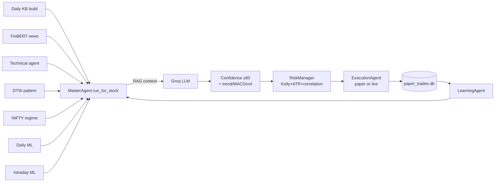

# Autonomous Trading Framework

Agent-orchestrated equity trading framework for the **Indian (NSE) market**. Combines technical indicators, FinBERT news sentiment, DTW pattern matching, market-regime detection, and two gradient-boosting ML models. Decisions are produced by an LLM (Groq Llama-3.3-70B via `litellm`) with a deterministic rule-based fallback, gated by hard filters and Kelly-half position sizing.

**Mode**: paper trading by default (SQLite ledger). Live mode via Zerodha Kite is supported by the broker abstraction; switching it on requires the steps in `docs/user-guide.md` §9.

---

## 60-second start

```bash
# Clone + create venv
git clone <this-repo> trading-framework
cd trading-framework
python3.10 -m venv .venv
source .venv/bin/activate
pip install -r requirements.txt

# Copy the secrets template and fill in at least GROQ_API_KEY
cp .env.example .env
# edit .env — see "Secrets" below

# Build per-stock knowledge bases
python -m agents.data_agent build RELIANCE      # smoke test
# (then loop the watchlist — see user guide §3.3)

# Run a single analysis cycle
python main.py

# Or open the dashboard (read-only)
streamlit run dashboard.py
```

For the full walkthrough see [`docs/user-guide.md`](docs/user-guide.md).

---

## Repository map

```
trading-framework/
├── main.py                     # one-shot cycle / scheduler bootstrap
├── config.yaml                 # runtime configuration (read-only for the daemon)
├── requirements.txt
├── pyproject.toml
│
├── agents/                     # trading agents (Agent ABC, AgentResult)
│   ├── master.py               # MasterAgent — orchestrator + LLM call
│   ├── data_agent.py           # KB builder
│   ├── news_agent.py           # FinBERT sentiment + tier classification
│   ├── technical_agent.py      # 0–10 composite score
│   ├── pattern_agent.py        # DTW matching + EV
│   ├── regime_agent.py         # NIFTY regime
│   ├── risk_manager.py         # Kelly + ATR + portfolio gates
│   ├── execution_agent.py      # SQLite paper-trade ledger
│   ├── learning_agent.py       # per-stock signal weights
│   ├── discovery_agent.py      # NSE / MoneyControl / Twitter scrape
│   ├── pre_open_monitor.py     # gap-up / gap-down 09:00 IST
│   ├── intraday_scanner.py     # 6-pattern intraday detector
│   └── earnings_calendar_agent.py
│
├── core/                       # shared infrastructure
│   ├── scheduler.py            # APScheduler daemon (Asia/Kolkata)
│   ├── knowledge_base.py       # per-stock JSON+parquet helpers
│   ├── broker.py               # Broker ABC, PaperBroker, ZerodhaBroker
│   ├── groww_client.py         # batch live LTP / quote / OHLC
│   ├── alerts.py               # Telegram alerter
│   ├── logger.py               # rotating file + console
│   ├── backtester.py           # event-driven backtester
│   ├── costs.py                # canonical slippage / brokerage / STT
│   ├── row_utils.py            # sqlite3.Row.get() helper
│   └── watchlist.py            # core_watchlist + dynamic merge
│
├── ripple/                     # sentiment subsystem
│   ├── sentiment_analyzer.py   # FinBERT + BART summariser
│   ├── twitter_collector.py    # Reddit + Yahoo News
│   ├── pipeline.py
│   └── config.py
│
├── ml_model.py                 # daily classifier (5d, +1.5%)
├── india_intraday_model.py     # 1h classifier (3h, +1.0%)
│
├── dashboard.py                # Streamlit UI
├── simulate_day.py             # time-travel a historical big-move day
├── test_stock.py               # full-pipeline single-stock demo
├── fetch_universe.py           # multi-exchange data downloader
├── backtest_gap.py             # gap-strategy backtest
├── backtest_intraday.py        # intraday-ML backtest
│
├── docs/                       # project documentation (start here)
│   ├── README.md
│   ├── user-guide.md           # OFFICIAL — install, configure, run, FAQ
│   ├── technical-reference.md  # OFFICIAL — APIs, schemas, ops
│   └── analysis/               # internal: architecture, issues, roadmap
│
├── docs-verification/          # findings + implementation logs (working notes)
├── tests/                      # pytest suite (41+ tests)
│
├── stocks/<SYM>/               # per-stock KB (parquet + JSON)
├── stocks_1h/                  # 1h candles + intraday model.pkl
├── data/dynamic_watchlist.json # auto-discovered symbols
├── paper_trades.db             # SQLite trade ledger
└── logs/                       # rotating logs
```

---

## What it does (high level)



For the full per-stock decision flow see [`docs/analysis/02-data-flow.md`](docs/analysis/02-data-flow.md).

---

## Documentation map

| You want to…                                | Read this                               |
|---------------------------------------------|-----------------------------------------|
| Install and run                             | [`docs/user-guide.md`](docs/user-guide.md) |
| Understand modules / extend code            | [`docs/technical-reference.md`](docs/technical-reference.md) |
| See diagrams of the decision pipeline       | [`docs/analysis/02-data-flow.md`](docs/analysis/02-data-flow.md) |
| Per-agent deep dive                         | [`docs/analysis/03-agents.md`](docs/analysis/03-agents.md) |
| Known issues and roadmap                    | [`docs/analysis/05-issues.md`](docs/analysis/05-issues.md) and [`docs/analysis/06-improvements.md`](docs/analysis/06-improvements.md) |
| Auto-generated knowledge graph              | [`graphify-out/GRAPH_REPORT.md`](graphify-out/GRAPH_REPORT.md) |

---

## Secrets

`.env` (never committed) holds runtime credentials. Minimal to run:

```bash
GROQ_API_KEY=                 # for the LLM (free tier at console.groq.com)
```

Optional but recommended:

```bash
GROWW_API_KEY=                # batch live LTP / quote / OHLC
GROWW_SECRET=
GROWW_TOTP_SECRET=
GROWW_ACCESS_TOKEN=

TELEGRAM_BOT_TOKEN=           # trade + emergency alerts
TELEGRAM_CHAT_ID=

ZERODHA_API_KEY=              # only if mode=live
ZERODHA_API_SECRET=
ZERODHA_ACCESS_TOKEN=
```

A template lives at [`.env.example`](.env.example). **Never check `.env` into git.** See [`docs/user-guide.md`](docs/user-guide.md) §3.2.

---

## Configuration

Edit [`config.yaml`](config.yaml) for runtime knobs (watchlist, capital, risk limits, schedule).

Key defaults:

| Knob                          | Default  | Effect                              |
|-------------------------------|----------|-------------------------------------|
| `trading.mode`                | `paper`  | `paper` (SQLite) or `live` (Zerodha)|
| `trading.capital`             | `10000`  | INR; affects position sizing        |
| `risk.kelly_fraction`         | `0.5`    | half-Kelly                          |
| `risk.max_loss_per_day_pct`   | `3.0`    | halts new trades for the day        |
| `risk.max_open_positions`     | `3`      | portfolio-wide                      |
| `llm.model`                   | `groq/llama-3.3-70b-versatile` | any litellm-supported id |

The full schema is documented in [`docs/technical-reference.md`](docs/technical-reference.md) §4.

---

## Testing

```bash
pip install pytest      # already in requirements.txt
python -m pytest        # 41+ tests
```

Tests live in `tests/` with one file per fix (`test_crit1_*.py`, `test_high5_*.py`, …). All pure unit — no network, no real LLM, no real broker calls.

---

## Status

This branch (`fix/verification-findings`) lands a one-shot batch of verification-driven fixes:
10 numbered findings (`docs-verification/findings.md`) addressed, 41 unit tests added, 0 regressions. See [`docs-verification/STATUS.md`](docs-verification/STATUS.md) for the live "what's left" tracker.

The framework is **not financial advice** — it's a research / learning tool. Use paper trading for at least a full month against your watchlist before considering live mode.
