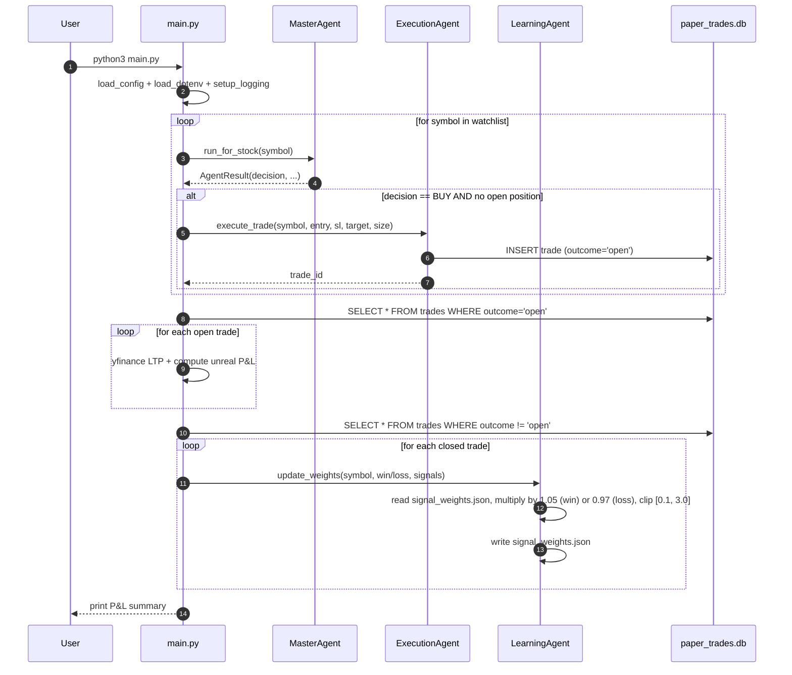
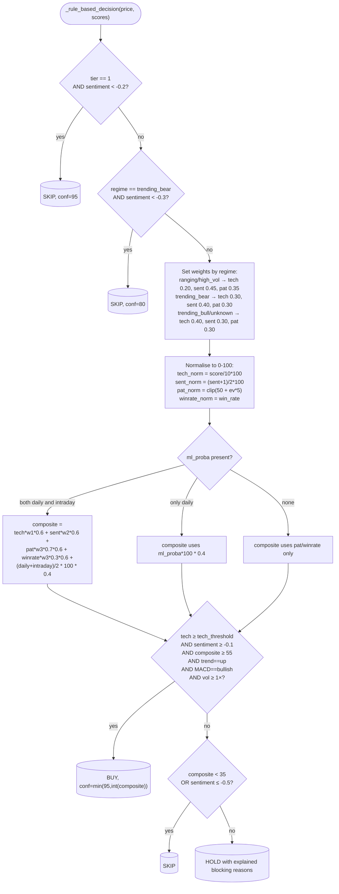
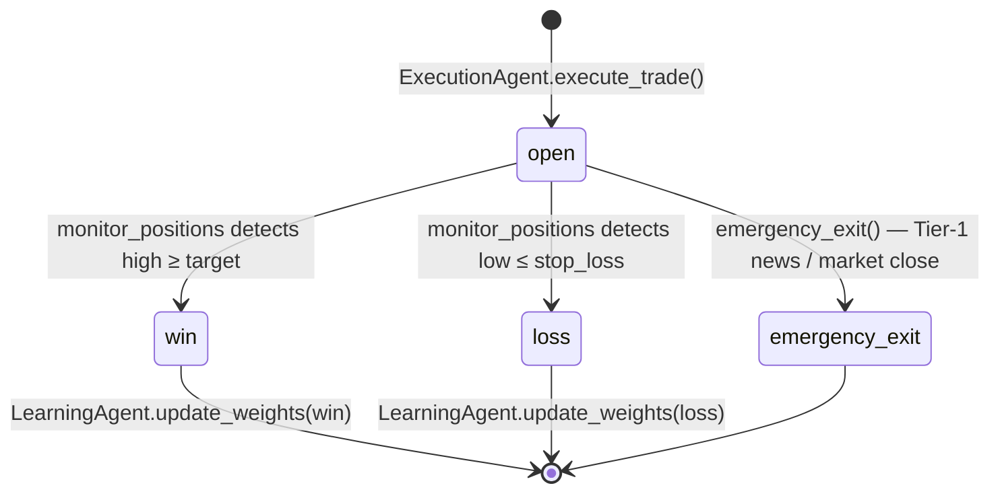
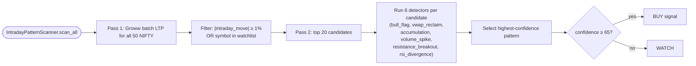

# 02 — Data Flow & Flowcharts (Internal Analysis)

> All diagrams are Mermaid — they render natively on GitHub. Open this file there or in a Markdown previewer that supports Mermaid.

---

## 1. System-level architecture

```mermaid
flowchart TB
  subgraph ENTRY["Entry Points"]
    M["main.py<br/>--once / default / --schedule"]
    S["core/scheduler.py<br/>APScheduler IST"]
    T["test_stock.py SYMBOL"]
    SD["simulate_day.py SYMBOL [DATE]"]
    DASH["streamlit run scripts/dashboard.py"]
    BTG["backtest_gap.py"]
    BTI["backtest_intraday.py"]
  end

  subgraph ORCH["Orchestration"]
    MA["MasterAgent.run_for_stock"]
  end

  subgraph SUB["Sub-agents"]
    DA["DataAgent"]
    NA["NewsAgent"]
    TA["TechnicalAgent"]
    PA["PatternAgent"]
    RA["RegimeAgent"]
    RM["RiskManager"]
  end

  subgraph DISC["Discovery / Monitoring"]
    DSC["DiscoveryAgent"]
    POM["PreOpenMonitor"]
    IPS["IntradayPatternScanner"]
    ECA["EarningsCalendarAgent"]
  end

  subgraph ML["ML Models"]
    MLD["models/ml_model.py<br/>(daily, 5d, 1.5%)"]
    MLI["models/india_intraday_model.py<br/>(1h, 3h, 1.0%)"]
    SENT["ripple/sentiment_analyzer<br/>FinBERT + BART summariser"]
  end

  subgraph SVC["Core services"]
    KB["core/knowledge_base.py"]
    BR["core/broker.py<br/>(Paper/Zerodha)"]
    GW["core/groww_client.py"]
    AL["core/alerts.py (Telegram)"]
    LG["core/logger.py"]
    BT["core/backtester.py"]
  end

  subgraph EXEC["Execution / Learning"]
    EA["ExecutionAgent"]
    LA["LearningAgent"]
  end

  subgraph STORE["Persistent storage"]
    KBFS["stocks/&lt;SYM&gt;/<br/>JSON + parquet"]
    H1["models/stocks_1h/<br/>parquet + .pkl"]
    DB["paper_trades.db<br/>(SQLite)"]
    CFG["config.yaml"]
    ENV[".env"]
    LOGS["logs/"]
  end

  M --> MA
  S --> MA
  S --> POM
  S --> IPS
  S --> ECA
  S --> DSC
  S --> EA
  T --> MA
  SD --> KB
  DASH --> DB
  DASH --> KBFS

  MA --> DA & NA & TA & PA & RA
  MA --> MLD & MLI
  MA --> SENT
  MA --> RM
  MA --> EA

  DA --> KB
  NA --> KB
  NA --> SENT
  PA --> KBFS
  RA -.NSE/VIX.-> NET[(Internet)]
  IPS --> GW
  POM -.NSE.-> NET
  ECA -.NSE/BSE.-> NET
  DSC -.NSE/MC/Nitter/Trends.-> NET

  EA --> DB
  EA --> BR
  LA --> DB
  LA --> KB

  KB --> KBFS
  MLD --> H1
  MLI --> H1

  EA -.alerts.-> AL
  IPS -.alerts.-> AL

  CFG -. read .-> M
  CFG -. read .-> S
  CFG -. read .-> MA
  ENV -. secrets .-> GW
  ENV -. secrets .-> AL
  ENV -. secrets .-> MA
```

---

## 2. The trade-decision pipeline (single stock)

This is what happens **inside one call to `MasterAgent.run_for_stock(symbol)`**.

```mermaid
flowchart TD
  Start(["run_for_stock SYM"]) --> Tech["TechnicalAgent.run"]
  Start --> News["NewsAgent.run"]
  Start --> Pat["PatternAgent.run"]
  Start --> Reg["RegimeAgent.run"]

  Tech --> Px["price = tech.current_price<br/>(yfinance fallback if missing)"]
  News --> Scores
  Pat --> Scores
  Reg --> Scores
  Px --> Scores["scores dict<br/>technical_score, RSI, MACD,<br/>intraday_*, sentiment, tier,<br/>pattern_ev, win_rate, regime"]

  Scores --> ML1{"ml_model.predict<br/>available?"}
  ML1 -- yes --> AddML["ml_proba, ml_signal"]
  ML1 -- no --> SkipML[("debug log")]

  AddML --> ML2{"intraday_model<br/>available?"}
  SkipML --> ML2
  ML2 -- yes --> Dyn["Compute dynamic_threshold<br/>(VIX, regime, hour, fo_days)<br/>→ intraday_ml_signal"]
  ML2 -- no --> Skip2[("debug log")]

  Dyn --> Tier{"Tier-1 emergency news<br/>AND sentiment &lt; -0.2?"}
  Skip2 --> Tier
  Tier -- yes --> SkipE[("decision=SKIP<br/>conf=95")]
  SkipE --> End

  Tier -- no --> RAG["_rag_context(symbol)<br/>fundamentals.json,<br/>event_reactions.json,<br/>sector_correlation.json,<br/>signal_weights.json,<br/>patterns.json"]
  RAG --> LLM{"_llm_decision<br/>litellm → groq/llama-3.3-70b"}

  LLM -- ok --> Parsed["{decision, confidence, entry,<br/>stop_loss, target, reasoning}"]
  LLM -- exception --> Rule["_rule_based_decision(price, scores)"]
  Rule --> Parsed

  Parsed --> ConfFloor{"decision == BUY<br/>AND confidence &lt; 60?"}
  ConfFloor -- yes --> ToHold["decision = HOLD"]
  ConfFloor -- no --> Filters

  ToHold --> Filters{"decision == BUY<br/>AND<br/>(trend != up<br/>OR MACD != bullish<br/>OR vol &lt; 1×)?"}
  Filters -- yes --> ToHold2["decision = HOLD<br/>append blocked-reasons"]
  Filters -- no --> Risk

  ToHold2 --> Risk{"decision == BUY?"}
  Risk -- no --> Out
  Risk -- yes --> RiskRun["RiskManager.run<br/>Kelly half + ATR SL +<br/>correlation + sector +<br/>daily/weekly/monthly limits"]

  RiskRun --> Allowed{"allowed?"}
  Allowed -- no --> SkipR["decision = SKIP<br/>reason = risk reason"]
  Allowed -- yes --> Sized["position_size, stop_loss<br/>(only override if LLM SL=0)"]
  SkipR --> Out
  Sized --> Out

  Out["AgentResult({decision,<br/>confidence, entry_price,<br/>stop_loss, target,<br/>position_size, reasoning,<br/>agent_scores})"]
  Out --> End(["return"])
```

### Notes on this flow

- **Hard filters are applied AFTER the LLM call.** If the LLM says BUY but the trend is sideways, MACD is bearish, or volume is below 1× the 20d average, the decision is downgraded to HOLD with a rule-based reason. This is your primary safety net against LLM over-confidence.
- **Confidence floor of 60.** A BUY with 59% confidence becomes a HOLD, regardless of LLM justification.
- **Risk manager only runs on BUY.** Sells are non-existent in the current model — the system is long-only and exits via SL/target/EOD.
- **The rule-based fallback** uses regime-aware weights (`trending_bull`, `trending_bear`, `ranging`, `high_volatility`) and a composite 0–100 score. ML probabilities are blended in at 40% weight when available.

---

## 3. End-of-day workflow (`main.py` default mode)

---

## 4. Scheduler timeline (Asia/Kolkata)

```mermaid
gantt
  dateFormat HH:mm
  axisFormat %H:%M
  title APScheduler jobs (IST)

  section Pre-market
  KB update (job_update_knowledge_bases)         :a1, 06:00, 30m
  Discovery (job_discover_stocks)                :a2, 07:00, 30m
  Pre-market analysis                            :a3, 08:30, 20m
  Pre-open scan + earnings morning               :a4, 09:00, 5m
  Generate signals                               :a5, 09:00, 10m

  section Market hours
  Execute trades                                 :b1, 09:15, 5m
  Monitor positions (every 5 min)                :b2, 09:15, 6h
  Intraday scan (every 5 min)                    :b3, 09:15, 6h
  Close all positions                            :b4, 15:00, 1m

  section Post-market
  Daily report + weekly analysis                 :c1, 15:30, 10m
  Earnings evening prep                          :c2, 15:30, 10m
  Watchlist prune                                :c3, 15:45, 5m

  section Overnight
  Earnings monitor (every 30m, 18:00–08:00)      :d1, 18:00, 14h
```

---

## 5. Data agent flow — building a stock's KB

```mermaid
flowchart LR
  Start(["DataAgent.build_kb(SYM)"]) --> Init["init_kb(SYM)<br/>create dir, write empty JSONs"]
  Init --> P["yf.Ticker(SYM.NS)"]

  P --> P1{"price_history.parquet exists?"}
  P1 -- yes --> P2["fetch from last_date+1"]
  P1 -- no --> P3["fetch from now - history_years*365"]
  P2 --> P4["concat + dedupe + write parquet"]
  P3 --> P4

  P4 --> F["fundamentals.json<br/>PE, EPS, sector, 52w, ROE, …"]
  F --> Q["earnings_history.json<br/>quarters + price_reaction_pct"]
  Q --> CA["corporate_actions.json<br/>dividends, splits"]
  CA --> SC["sector_correlation.json<br/>vs ^NSEI + 8 sector indices"]
  SC --> ER["event_reactions.json<br/>avg(beat) / avg(miss) from earnings_history"]
  ER --> SW["signal_weights.json<br/>(only if not present)"]
  SW --> Done(["return kb_results"])
```

The **incremental fetch** (only new bars) is good. The **per-correlation network call** is not — see `05-issues.md`.

---

## 6. Decision-rule fallback (composite score)

---

## 7. Position lifecycle

The transition `open → emergency_exit` is hit by **two different jobs**: the news monitor (when Tier-1 news appears for an open position) and `job_close_all_positions` at 15:00 IST.

---

## 8. Multi-pass intraday scanner

The two-pass design is the right shape — 50 symbols cheap, 20 deep — but the deep scan still goes through `yfinance` for each candle history fetch (slow, see `05-issues.md`).
