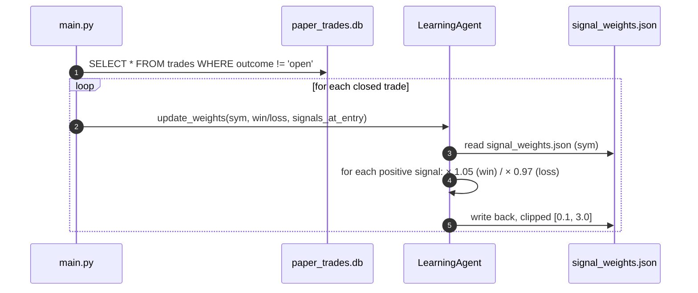

# 04 — Decision Pipeline (Internal Analysis)

> A precise, line-by-line walkthrough of how a single `BUY/HOLD/SKIP` decision is produced for one symbol. This document complements the diagrams in `02-data-flow.md`.

---

## 1. Trigger paths

A decision can be requested from any of:
- `python main.py` (default mode) — for every `config.watchlist` symbol.
- `python main.py --once` / `python main.py --schedule` — runs `core/scheduler.py:job_generate_signals` and `job_execute_trades`.
- `python -m agents.master` — single-symbol smoke test.
- `python test_stock.py SYMBOL` — full demo.

All paths converge on `MasterAgent.run_for_stock(symbol: str) -> AgentResult`.

---

## 2. Step-by-step (with code references)

### Step 1 — Sub-agent fan-out

```python
tech_result    = self.technical_agent.run({"symbol": symbol})
news_result    = self.news_agent.run({"symbol": symbol})
pattern_result = self.pattern_agent.run({"symbol": symbol})
regime_result  = self.regime_agent.run({"symbol": symbol})
```

Sequential, not parallel. If any agent errors, `result.ok()` is False and we use `data = {}` → defaults applied later. **No early termination** if any one fails (unlike DataAgent, which is implicit: `TechnicalAgent` requires `price_history.parquet` to exist, so DataAgent must have run earlier).

### Step 2 — Resolve current price

```python
price = tech.get("current_price", 0.0)
if not price:
    price = yfinance.Ticker(symbol+".NS").history(period="1d").Close.iloc[-1]
```

A backup price fetch is performed if the technical agent didn't supply one. If yfinance also fails, `price = 0.0` and the trade will be sized to zero downstream.

### Step 3 — Build the `scores` dict

The `scores` dict is the single feature blob shared with both the LLM (via prompt) and the rule-based fallback. Keys (with their providers):

| Key                    | From                  | Notes                                         |
|------------------------|-----------------------|-----------------------------------------------|
| `technical_score`      | TechnicalAgent        | 0–10                                          |
| `rsi`                  | TechnicalAgent        | last close RSI(14)                            |
| `macd_signal`          | TechnicalAgent        | bullish/bearish/neutral                       |
| `trend`                | TechnicalAgent        | up/down/sideways                              |
| `volume_ratio`         | TechnicalAgent        | last day vs 20d avg                           |
| `intraday_rsi5`        | TechnicalAgent        | 5m RSI (optional, may be `None`)              |
| `intraday_macd`        | TechnicalAgent        | bullish/bearish on 5m                         |
| `intraday_score`       | TechnicalAgent        | 0–3                                           |
| `intraday_vs_vwap`     | TechnicalAgent        | last 5m close − VWAP                          |
| `sentiment`            | NewsAgent (FinBERT)   | −1 to +1                                      |
| `tier`                 | NewsAgent             | 1/2/3 or `None`                               |
| `pattern_ev`           | PatternAgent          | %, expected value of next 10 days             |
| `win_rate`             | PatternAgent          | % over top-5 historical matches               |
| `regime`               | RegimeAgent           | one of 4 strings                              |

### Step 4 — Daily ML signal (advisory)

```python
from ml_model import predict as ml_predict
ml = ml_predict(symbol)
scores["ml_proba"]  = ml["ml_proba"]
scores["ml_signal"] = ml["ml_signal"]
```

Wrapped in try/except → `None` on any failure (model not trained, parquet missing, market data unreachable). Notably **no warning is logged** at WARN — only DEBUG. Easy to miss that ML is silently absent.

### Step 5 — Intraday ML signal + dynamic threshold

```python
intra = intraday_predict(symbol)
vix_val = yfinance(^INDIAVIX).Close.iloc[-1]   # default 16.0
fo_days = _fo_expiry_days(now)
dyn_thresh = dynamic_threshold(vix_val, regime, hour, fo_days)

intra_signal = "BUY"  if proba >= dyn_thresh
              else "HOLD" if proba >= dyn_thresh - 0.10
              else "SKIP"
```

`dynamic_threshold` adjusts the base 0.55 by:
- `+0.08` if VIX > 25, `+0.04` if > 20, `−0.03` if < 13
- `−0.03` for `trending_bull`, `+0.05` for `trending_bear` or `high_volatility`
- `+0.04` at 09:00 (gap-fill), `+0.03` at 15:00 (closing)
- `+0.07` on F&O expiry day, `+0.03` if expiry within 2 days
- Final clipped to [0.45, 0.80].

This means the **same model + same data** produces different signals depending on calendar/time conditions. Intentional.

### Step 6 — Tier-1 emergency skip

```python
if scores["tier"] == 1 and scores["sentiment"] < -0.2:
    return SKIP, conf=95
```

This is the **only** path that bypasses the LLM. Everything else, including obvious bear regimes, still consults the LLM.

### Step 7 — RAG context retrieval

```python
rag = _rag_context(symbol)
# Reads:
#   fundamentals.json
#   event_reactions.json
#   sector_correlation.json
#   signal_weights.json
#   patterns.json
```

The result includes `sector`, `pe_ratio`, `eps`, earnings beat/miss avg reactions, top-2 correlations, signal weights, pattern summary. Some of this is also injected into the LLM prompt directly inside `_llm_decision`.

### Step 8 — LLM decision

```python
prompt = """You are an expert Indian stock trader. Make a trading decision...
Return ONLY valid JSON: {decision, confidence, entry, stop_loss, target, reasoning}
STOCK: SYM | <name> | <sector>
CURRENT PRICE: ₹X | 52W: ...
TECHNICAL SCORE: ... INTRADAY (5m): ...
NEWS SENTIMENT: ... RECENT HEADLINES: ...
PATTERN EV: ... ML MODEL: ...
INDIA INTRADAY ML (1h): ...
MARKET REGIME: ... CORRELATIONS: ...
"""
response = litellm.completion(model=groq/llama-3.3-70b-versatile, ...)
```

The model is configured with `temperature: 0.1, max_tokens: 200` (overridden — config says 2000 but the call hard-codes 200). The output is parsed as JSON with a markdown-fence stripper. **Any exception** falls through to `_rule_based_decision`.

### Step 9 — Confidence floor

```python
if confidence < 60 and decision == "BUY":
    decision = "HOLD"
    reasoning = f"Confidence too low ({confidence}%) — holding"
```

### Step 10 — Hard filter gate

```python
if decision == "BUY":
    if trend != "up" or macd_signal != "bullish" or vol_ratio < 1.0:
        decision = "HOLD"
        reasoning = f"LLM said BUY but filters blocked: {blocked}"
```

Backtest-validated minimum bar (per code comment). This is the **single most important guard** against LLM hallucinations producing premature longs.

### Step 11 — Risk manager (BUY only)

```python
if decision == "BUY":
    risk = self.risk_manager.run({
        symbol, entry_price=price,
        win_rate=scores["win_rate"], avg_win=pattern.avg_win, avg_loss=abs(pattern.avg_loss),
        open_positions=[], daily_pnl_pct=0.0,
    })
    position_size = risk.position_size
    stop_loss = stop_loss or risk.stop_loss
    if not risk.allowed:
        decision = "SKIP"
        reasoning = risk.reason
```

Two important quirks:
- `open_positions=[]` is **always passed empty**. This means correlation and sector-overlap checks **never fire from the master flow**. (The risk manager's gate logic exists; just never receives real input.)
- `daily_pnl_pct=0.0` is hard-coded. The daily-loss circuit breaker similarly never fires from this code path.

These are bugs / unfinished wiring — see `05-issues.md`.

### Step 12 — Final result

```python
return AgentResult(data={
    "symbol", "decision", "confidence",
    "entry_price", "stop_loss", "target",
    "position_size", "reasoning", "agent_scores"
})
```

The caller (`main.py` or scheduler) uses `decision` and the position fields to call `ExecutionAgent.execute_trade` if BUY.

---

## 3. Where the system can over-rule the LLM

In order, after `_llm_decision`:

1. Tier-1 + negative-sentiment **emergency skip** (pre-LLM).
2. **Confidence < 60** → HOLD.
3. **Hard filters** (trend/MACD/volume) → HOLD.
4. **Risk manager block** (loss limits, correlation, sector) → SKIP.

The LLM cannot up-grade its own confidence past 60 and override these gates. It also **cannot** cause a SELL — there is no SELL handler in `main.py` or the scheduler.

---

## 4. Where the LLM can over-rule rules

The LLM's `confidence` and `reasoning` go into the trade record, but the **mechanical decision** is constrained:
- An LLM SKIP/HOLD is final.
- An LLM BUY only survives if it clears all four gates above.
- Stop-loss / target from the LLM are kept as-is; they are only overridden when missing or if the risk manager assigns its own ATR-based SL.

So the LLM's actual influence is: **rejecting borderline rule-based BUYs** and **adding context-aware reasoning text**.

---

## 5. The LearningAgent loop (post-trade feedback)

> **✅ Fixed in `fix/verification-findings`** (CRIT-1 + CRIT-2). The `sqlite3.Row.get` crash is gone, and the `trades` schema now stores entry-time signals so the loop has real values to learn from. The diagram below now accurately describes runtime behaviour.

Triggered by `main.py` (default mode) after each cycle:



But: **this loop runs every time `main.py` is invoked** (not just for newly-closed trades), so every closed trade is re-applied on every run. Net effect: signal weights drift much faster than expected. See issues.

---

## 6. End-to-end timing (single stock, observed)

Empirical timings on a typical run (rough; depends on network and model availability):

| Stage                          | Wall time |
|--------------------------------|-----------|
| TechnicalAgent (parquet read + indicators) | ~0.3 s   |
| NewsAgent (yfinance + FinBERT first call)  | 1–6 s    |
| PatternAgent (DTW × ~1000 windows)         | 2–5 s    |
| RegimeAgent (yfinance Nifty + VIX)         | 1–2 s    |
| ml_model.predict (re-fetches market data)  | 2–10 s   |
| india_intraday_model.predict               | 1–3 s    |
| LLM call (Groq llama-3.3-70b)              | 1–3 s    |
| RiskManager (parquet ATR + JSON reads)     | <0.1 s   |

Total per-stock: **typically 10–25 seconds**. For a 50-stock watchlist that's ~10–20 minutes per pass — far too slow to fit a single `09:15` execute slot if every signal is regenerated. In practice the schedule overlaps `job_generate_signals` (09:00) and `job_execute_trades` (09:15), so signals are warm.
