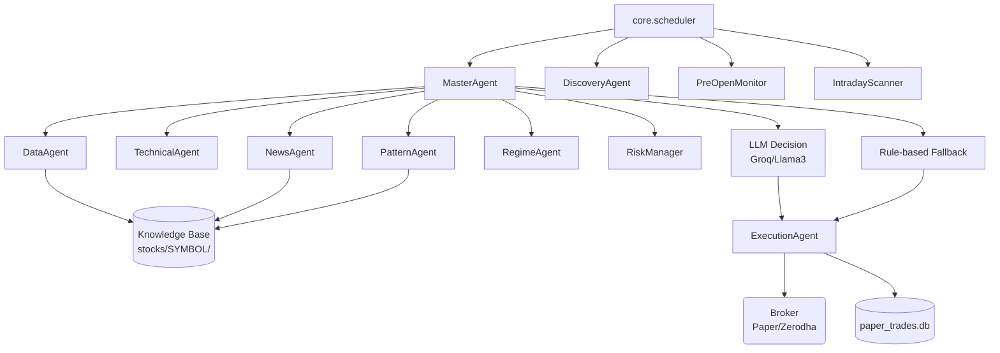

# Technical Documentation: Autonomous Trading Framework

## Overview

The Autonomous Trading Framework is a Python-based multi-agent system designed for automated stock market trading, primarily focused on the Indian stock market (NSE). It utilizes a combination of technical analysis, fundamental data, sentiment analysis (news & social media), pattern recognition, and machine learning models to generate trading signals and execute trades.

The framework is highly modular, with specialized agents handling different aspects of the trading pipeline, all orchestrated by a `MasterAgent`. The system operates on a scheduled timeline (using `APScheduler`) to align with market hours.

## Architecture

The system is built on an Agent-based architecture.

### Core Components

#### 1. Core Modules (`core/`)
- **`scheduler.py`**: The heartbeat of the system. Uses `APScheduler` to trigger jobs at specific times (IST) like pre-market analysis, signal generation, intraday scanning (every 5 minutes), and post-market reporting.
- **`knowledge_base.py`**: Manages the local per-stock datastore (`stocks/<SYMBOL>/`), storing price history (`.parquet`) and various `.json` files (fundamentals, earnings, sector correlations, etc.).
- **`broker.py`**: An abstraction layer for trade execution. Contains `PaperBroker` (simulated execution) and `ZerodhaBroker` (live execution via Kite Connect API).
- **`alerts.py`**: Telegram integration for sending trading alerts and daily summaries.

#### 2. Agents (`agents/`)
Agents inherit from `agents.base.Agent` and return `AgentResult`.

- **`MasterAgent`**: The central orchestrator. Runs sub-agents to collect technical, sentiment, and pattern scores. Aggregates data, incorporates ML model predictions, and makes a final `BUY/SELL/HOLD/SKIP` decision via an LLM (`litellm`) or a comprehensive rule-based fallback.
- **`DataAgent`**: Responsible for data ingestion. Fetches OHLCV data via `yfinance`, fundamentals, earnings history, and computes sector correlations to build the Knowledge Base.
- **`TechnicalAgent`**: Calculates technical indicators (RSI, MACD, EMA) and assigns a technical score (0-10) for a given symbol.
- **`NewsAgent`**: Scrapes news (MoneyControl, Economic Times, NSE announcements), runs sentiment analysis using a FinBERT-like pipeline, and categorizes news into tiers (e.g., Tier 1 for emergency).
- **`PatternAgent`**: Detects chart patterns (e.g., Bull Flag, RSI Divergence) and calculates Expected Value (EV) and win rates based on historical backtesting.
- **`RegimeAgent`**: Determines the overall market regime (e.g., trending_bull, trending_bear, ranging) to dynamically adjust trading thresholds.
- **`RiskManager`**: Determines position sizing (e.g., Kelly Criterion) and validates if a trade is allowed based on risk parameters.
- **`ExecutionAgent`**: Manages paper trading logic, stores trades in `paper_trades.db`, and monitors open positions for stop-loss or target hits.
- **`DiscoveryAgent`**: Discovers new potential stocks to trade based on news volume, Google trends, and NSE movers, and updates the `config.yaml` watchlist.
- **`IntradayScanner`**: Runs every 5 minutes to detect intraday setups.
- **`LearningAgent`**: Updates signal weights in the Knowledge Base post-trade to improve future decision-making based on past performance.

#### 3. Machine Learning Models
- **`ml_model.py`**: A daily timeframe model predicting the probability of a positive outcome.
- **`india_intraday_model.py`**: An intraday (1h candle) model specific to Indian stocks, utilizing dynamic thresholds based on VIX and options expiry.

## Workflow

1. **Pre-Market (06:00 - 09:00):**
   - `DataAgent` updates knowledge bases for the current watchlist.
   - `DiscoveryAgent` finds new stocks and updates the watchlist.
   - `PreOpenMonitor` scans for gap-up/gap-down opportunities.
   - `RegimeAgent` assesses market conditions.

2. **Market Open (09:00 - 09:15):**
   - `MasterAgent` evaluates each stock in the watchlist. It queries `TechnicalAgent`, `NewsAgent`, `PatternAgent`, and ML models.
   - The LLM (or rule-based system) outputs decisions and stop-loss/target levels.

3. **Intraday (09:15 - 15:00):**
   - `ExecutionAgent` opens paper trades based on "BUY" signals.
   - Every 5 minutes, `IntradayScanner` looks for new patterns.
   - Every 5 minutes, `ExecutionAgent` monitors open positions against current LTP (Last Traded Price). If Target or SL is hit, the trade is closed.
   - `NewsAgent` monitors news for open positions. Tier 1 negative news triggers an emergency exit.

4. **Market Close (15:00 - 15:30):**
   - `ExecutionAgent` performs a hard close of all remaining open intraday positions.
   - `LearningAgent` updates weights.
   - A daily P&L report is generated and sent via Telegram.

## Data Storage

- **SQLite Database (`paper_trades.db`)**: Stores the history of all trades, entry/exit prices, PnL, and the reasoning behind the trade.
- **Knowledge Base (`stocks/<SYMBOL>/`)**:
  - `price_history.parquet`: Efficient storage for OHLCV data.
  - `fundamentals.json`, `news_history.json`, `sector_correlation.json`, etc.: Persisted context for the LLM and rule engines.

## Potential Improvements & Issues

- **Coupling with yfinance:** The framework relies heavily on `yfinance`, which can be unreliable or rate-limited. Moving to a dedicated data provider (e.g., TrueData, eSignal) would improve robustness.
- **Live Trading:** The `ZerodhaBroker` is implemented but live trading logic in `ExecutionAgent` is mostly disabled/paper-focused. Needs rigorous safety checks before enabling live capital.
- **LLM Latency & Cost:** Calling an LLM for every stock decision daily can be slow and expensive. The rule-based fallback is solid, but evaluating the LLM's true alpha vs. cost is necessary.
- **State Management:** The use of `sqlite3` without an ORM (like SQLAlchemy) might become difficult to maintain as the schema grows.
- **Logging:** While `logger` is used, a centralized metrics dashboard (e.g., Prometheus/Grafana or ELK) would greatly assist in monitoring agent performance in real-time.
