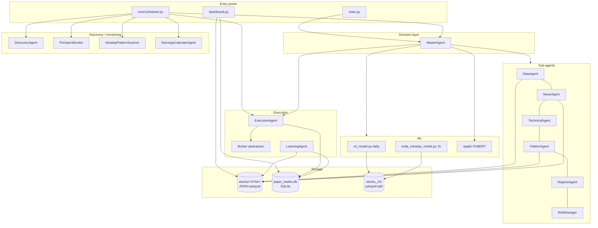

# Technical Reference — Autonomous Trading Framework

> Audience: engineers integrating with, extending, or maintaining this codebase.
> See `user-guide.md` for installation and day-to-day operation; see `analysis/` for internal commentary.

---

## 1. Overview

The Autonomous Trading Framework is a Python single-process system that:
1. Maintains a per-stock knowledge base (price history, fundamentals, news, patterns).
2. Runs a fan-out of analysis agents (technical, news, pattern, regime, ML).
3. Uses an LLM (Groq Llama-3.3-70B via `litellm`) — with deterministic fallback — to decide BUY / HOLD / SKIP.
4. Sizes positions with half-Kelly + ATR-based stops + portfolio gates.
5. Records paper trades in SQLite, monitors them every 5 minutes, closes on SL/target/EOD/Tier-1 news.
6. Updates per-stock signal weights from realised outcomes.

It is designed for the **Indian equities market** (NSE), in particular the NIFTY 50 universe.

**Trading mode is `paper` by default.** Live trading via Zerodha Kite is supported by the broker abstraction but not wired through `ExecutionAgent` yet — see §11.

---

## 2. System architecture



See `analysis/02-data-flow.md` for the full per-stock decision flow and the scheduler timeline.

---

## 3. Repository layout

```
trading-framework/
├── main.py                          # Entry point (single cycle / scheduler bootstrap)
├── config.yaml                      # Runtime configuration
├── requirements.txt
├── pyproject.toml
│
├── agents/                          # Trading agents
│   ├── base.py                      # Agent ABC + AgentResult
│   ├── master.py                    # MasterAgent (orchestrator)
│   ├── data_agent.py
│   ├── news_agent.py
│   ├── technical_agent.py
│   ├── pattern_agent.py
│   ├── regime_agent.py
│   ├── risk_manager.py
│   ├── execution_agent.py
│   ├── learning_agent.py
│   ├── discovery_agent.py
│   ├── pre_open_monitor.py
│   ├── intraday_scanner.py
│   └── earnings_calendar_agent.py
│
├── core/                            # Shared infrastructure
│   ├── scheduler.py                 # APScheduler daemon
│   ├── knowledge_base.py            # Per-stock JSON/parquet helpers
│   ├── broker.py                    # PaperBroker, ZerodhaBroker
│   ├── groww_client.py              # Groww live data client
│   ├── alerts.py                    # Telegram alerter
│   ├── logger.py                    # Rotating file + console logger
│   └── backtester.py                # Event-driven backtester
│
├── ripple/                          # Sentiment subsystem
│   ├── sentiment_analyzer.py        # FinBERT + BART
│   ├── twitter_collector.py         # Reddit + Yahoo (legacy name)
│   ├── pipeline.py
│   └── config.py
│
├── ml_model.py                      # Daily classifier (5d, 1.5%)
├── india_intraday_model.py          # 1h classifier (3h, 1.0%)
│
├── dashboard.py                     # Streamlit UI (5 tabs)
├── simulate_day.py                  # Time-travel single-day replay
├── test_stock.py                    # Full-pipeline single-stock demo
├── fetch_universe.py                # Multi-exchange price downloader
├── backtest_gap.py                  # Standalone gap-strategy backtest
├── backtest_intraday.py             # Standalone intraday-ML backtest
│
├── stocks/<SYM>/                    # Per-stock knowledge base
│   ├── price_history.parquet
│   ├── fundamentals.json
│   ├── earnings_history.json
│   ├── corporate_actions.json
│   ├── sector_correlation.json
│   ├── event_reactions.json
│   ├── signal_weights.json
│   ├── news_history.json
│   ├── patterns.json
│   └── bulk_deals.json
│
├── stocks_1h/                       # 1h candles + intraday model
│   ├── *.parquet
│   ├── NIFTY_1h.parquet
│   ├── BANKNIFTY_1h.parquet
│   ├── VIX_1h.parquet
│   └── india_intraday_model.pkl
│
├── paper_trades.db                  # SQLite ledger
└── logs/
    ├── trading.log
    └── scheduler.log
```

---

> **Heads-up**: `dashboard.py` imports `streamlit` and `plotly`. As of `fix/verification-findings` (HIGH-4) both are listed in `requirements.txt`; if you have an older `.venv`, run `pip install -r requirements.txt` to pick them up.

## 4. Configuration

All runtime configuration lives in `config.yaml` (read at startup; some agents reload it). Secrets live in `.env`.

### 4.1. `config.yaml` schema

| Key                                | Type      | Default                      | Purpose                                                                   |
|------------------------------------|-----------|------------------------------|---------------------------------------------------------------------------|
| `data.history_years`               | int       | 5                            | How many years of OHLCV to fetch on KB build                              |
| `data.timeframes`                  | list[str] | `[1d,1h,15m,5m]`             | Reserved (not all timeframes wired today)                                 |
| `llm.model`                        | str       | `groq/llama-3.3-70b-versatile` | Any litellm-supported model id                                          |
| `llm.max_tokens`                   | int       | 2000 *(prompt level uses 200)* | Hard limit on completion length                                          |
| `llm.temperature`                  | float     | 0.1                          | LLM temperature                                                           |
| `risk.kelly_fraction`              | float     | 0.5                          | Fraction of full Kelly to use (half-Kelly default)                        |
| `risk.max_loss_per_trade_pct`      | float     | 1.0                          | Risk cap per trade                                                        |
| `risk.max_loss_per_day_pct`        | float     | 3.0                          | Halts new trades for the day                                              |
| `risk.max_loss_per_week_pct`       | float     | 7.0                          | Triggers 50% size reduction                                               |
| `risk.max_loss_per_month_pct`      | float     | 15.0                         | Logged; no automatic action                                               |
| `risk.max_open_positions`          | int       | 3                            | Across the entire portfolio                                               |
| `risk.trailing_stop_trigger_pct`   | float     | 1.0                          | Activate trailing stop after this profit %                                |
| `risk.trailing_stop_distance_pct`  | float     | 0.5                          | Trail this far below current high                                         |
| `risk.close_all_time`              | str       | `15:00`                      | IST market-close cutoff                                                   |
| `schedule.market_open_signals`     | str       | `09:00`                      | (Cron-driven; see scheduler section)                                      |
| `schedule.market_open_execute`     | str       | `09:15`                      |                                                                           |
| `schedule.intraday_interval_minutes` | int     | 5                            | Position monitor + intraday scan cadence                                  |
| `schedule.post_market`             | str       | `15:30`                      |                                                                           |
| `schedule.pre_market_data`         | str       | `06:00`                      |                                                                           |
| `schedule.pre_market_analysis`     | str       | `08:30`                      |                                                                           |
| `trading.mode`                     | str       | `paper`                      | `paper` or `live`                                                         |
| `trading.capital`                  | int       | 10000                        | Total capital in INR                                                      |
| `trading.currency`                 | str       | `INR`                        | Reserved                                                                  |
| `watchlist`                        | list[str] | NIFTY 50                     | NSE root symbols (no `.NS` suffix)                                        |
| `core_watchlist`                   | list[str] | 5 symbols                    | Symbols never pruned by the watchlist trimmer                             |
| `watchlist_max`                    | int       | 20                           | Hard cap on watchlist size                                                |
| `telegram.enabled`                 | bool      | false                        | Read by alerts module (token presence is the real switch)                 |
| `logging.level`                    | str       | `INFO`                       | Standard Python logging level                                             |
| `logging.file`                     | str       | `logs/trading.log`           |                                                                           |
| `logging.max_bytes`                | int       | 10485760                     | Rotate after 10 MB                                                        |
| `logging.backup_count`             | int       | 5                            |                                                                           |

### 4.2. `.env` keys

| Key                                                                  | Purpose                                                |
|----------------------------------------------------------------------|--------------------------------------------------------|
| `OPENAI_API_KEY`, `ANTHROPIC_API_KEY`                                | Optional (litellm picks the right one for `llm.model`) |
| `AWS_ACCESS_KEY_ID`, `AWS_SECRET_ACCESS_KEY`, `AWS_REGION`           | For litellm-bedrock (alternate LLM provider)           |
| `GROWW_API_KEY`, `GROWW_SECRET`, `GROWW_TOTP_SECRET`, `GROWW_ACCESS_TOKEN` | Live LTP/quote/OHLC client                       |
| `TWITTER_BEARER_TOKEN`, `TWITTER_API_KEY`, `TWITTER_API_SECRET`, `TWITTER_ACCESS_TOKEN`, `TWITTER_ACCESS_TOKEN_SECRET` | Reserved; the active Twitter path uses Nitter scraping |
| `TELEGRAM_BOT_TOKEN`, `TELEGRAM_CHAT_ID`                             | Alert delivery                                         |
| `ZERODHA_API_KEY`, `ZERODHA_API_SECRET`, `ZERODHA_ACCESS_TOKEN`      | Live trading via Kite Connect                          |

> **Security**: do not commit `.env`. It is in `.gitignore` already; rotate any keys that were ever shared. See `analysis/05-issues.md` §A1.

---

## 5. Module reference

### 5.1. `agents.base`

```python
class AgentStatus(Enum):
    IDLE = "idle"; RUNNING = "running"; DONE = "done"; ERROR = "error"

@dataclass
class AgentResult:
    agent_name: str
    status: AgentStatus
    data: dict[str, Any]
    error: Optional[str] = None
    timestamp: datetime = field(default_factory=datetime.now)
    def ok(self) -> bool: ...

class Agent(ABC):
    def __init__(self, name: str, config: dict): ...
    @abstractmethod
    def run(self, context: Optional[dict] = None) -> AgentResult: ...
    def status(self) -> AgentStatus: ...
    def report(self) -> dict: ...
```

### 5.2. `agents.master:MasterAgent`

```python
class MasterAgent(Agent):
    def __init__(self, config: dict)
    def run(self, context) -> AgentResult     # expects context["symbol"]
    def run_for_stock(self, symbol: str) -> AgentResult
```

Returns `data = {symbol, decision, confidence, entry_price, stop_loss, target, position_size, reasoning, agent_scores}`. `decision ∈ {"BUY", "HOLD", "SKIP"}` (no SELL).

### 5.3. `agents.data_agent:DataAgent`

```python
class DataAgent(Agent):
    def build_kb(self, symbol: str) -> dict
    def load_price_history(self, symbol: str) -> Optional[pd.DataFrame]
```

Side effects: writes 7 files under `stocks/<SYM>/`. Incremental for `price_history.parquet`; full-refresh for the rest.

### 5.4. `agents.news_agent:NewsAgent`

```python
class NewsAgent(Agent):
    def analyze(self, symbol: str) -> dict
    def monitor_open_positions(self, symbols: list[str]) -> dict[str, Optional[int]]
```

`analyze()` returns `{symbol, sentiment ∈ [-1,1], tier ∈ {1,2,3,None}, news_count, headlines (top 3)}`.

### 5.5. `agents.technical_agent:TechnicalAgent`

```python
class TechnicalAgent(Agent):
    def run(self, context: dict) -> AgentResult     # context["symbol"]
```

Returns 18 fields (see `analysis/03-agents.md` §4). Requires ≥200 bars of price history.

### 5.6. `agents.pattern_agent:PatternAgent`

```python
class PatternAgent(Agent):
    def run(self, context: dict) -> AgentResult
```

Window 20d, lookahead 10d, top-K=5. Requires `dtaidistance` (Euclidean fallback if missing — quality regression).

### 5.7. `agents.regime_agent:RegimeAgent`

```python
class RegimeAgent(Agent):
    def run(self, context=None) -> AgentResult
```

Classifies NIFTY into `trending_bull / trending_bear / high_volatility / ranging`.

### 5.8. `agents.risk_manager:RiskManager` + helpers

```python
def kelly_size(win_rate, avg_win_pct, avg_loss_pct, capital, kelly_fraction=0.5) -> float
def compute_atr(symbol: str, period: int = 14) -> float
def atr_stop_loss(entry_price: float, symbol: str, atr_multiplier: float = 2.0) -> float
def trailing_stop(current_price, entry_price, current_stop, activate_after_pct=1.0, trail_distance_pct=0.5) -> float
def check_trade_allowed(daily_pnl_pct, weekly_pnl_pct=0.0, monthly_pnl_pct=0.0) -> tuple[bool, str]
def check_correlation(symbol, open_positions) -> tuple[bool, str]
def check_sector_overlap(symbol, open_positions) -> tuple[bool, str]

class RiskManager(Agent):
    def run(self, context: dict) -> AgentResult     # context: symbol, entry_price, win_rate, avg_win, avg_loss, open_positions, daily_pnl_pct, weekly_pnl_pct, monthly_pnl_pct
```

Returns `{allowed, position_size, stop_loss, reason}`.

### 5.9. `agents.execution_agent:ExecutionAgent`

```python
DB_PATH = .../paper_trades.db
SLIPPAGE  = 0.0005
BROKERAGE = 0.0003

class ExecutionAgent(Agent):
    def execute_trade(self, symbol, entry_price, stop_loss, target, position_size, reasoning="") -> dict
    def monitor_positions(self) -> list[dict]            # closes any SL/target hit
    def emergency_exit(self, symbol, reason="emergency") -> Optional[dict]
    def daily_report(self) -> dict
```

### 5.10. `agents.learning_agent:LearningAgent`

```python
WIN_BOOST = 1.05; LOSS_DECAY = 0.97
MIN_WEIGHT = 0.1; MAX_WEIGHT = 3.0
WEIGHT_SIGNALS = ["technical_score","news_sentiment","pattern_ev","sector_momentum","regime_alignment"]

class LearningAgent(Agent):
    def update_weights(self, symbol, trade_outcome, signals_at_entry) -> dict
    def weekly_analysis(self, symbol) -> str
```

> ✅ Fixed in `fix/verification-findings` (CRIT-1 + CRIT-2). The crash is gone; the `trades` schema now stores entry-time signals so weights actually update.

### 5.11. Discovery / monitoring agents

```python
class DiscoveryAgent(Agent):
    def discover(self, top_n=10) -> dict
    # data: {candidates: [...], added_to_watchlist: [...], scanned_at}

class PreOpenMonitor(Agent):
    def scan(self) -> dict
    # data: {scanned_at, total_scanned, significant_gaps, buy_signals, avoid_signals, watch_signals, all_preopen}

class IntradayPatternScanner(Agent):
    def scan_all(self) -> dict
    # data: {scanned_at, total_nifty50, candidates_deep_scanned, buy_signals, avoid_signals, watch_signals, all_ltps}
    # ✅ Fixed in `fix/verification-findings` (HIGH-3): CANDLE_LOOKBACK and
    # CANDLE_INTERVAL are now defined at the top of agents/intraday_scanner.py.
    # The scanner produces real patterns again.

class EarningsCalendarAgent(Agent):
    def evening_prep(self) -> dict
    def overnight_monitor(self) -> dict
    def morning_scan(self) -> dict
    def get_signal_for_stock(self, symbol: str) -> Optional[dict]
```

### 5.12. ML modules

```python
# ml_model.py (daily, 5-day forward, 1.5% threshold)
def train() -> None
def predict(symbol: str) -> dict
# Returns: {symbol, ml_signal: "BUY"|"HOLD"|"SKIP", ml_proba: float, confidence: float}
# Model artefact: stocks/ml_signal_model.pkl

# india_intraday_model.py (1h, 3h forward, 1.0% threshold)
def fetch_all() -> None              # writes stocks_1h/<SYM>.parquet + index files
def train() -> None
def predict(symbol: str) -> dict
def dynamic_threshold(vix, regime, hour, fo_days) -> float    # in [0.45, 0.80]
# Model artefact: stocks_1h/india_intraday_model.pkl
```

### 5.13. Core services

```python
# core/knowledge_base.py
def kb_path(symbol: str) -> Path
def init_kb(symbol: str) -> None
def read_kb(symbol: str, key: str) -> dict
def write_kb(symbol: str, key: str, data: dict) -> None

# core/broker.py
class Broker(ABC):
    def place_order(symbol, qty, order_type, price, sl=0.0, tag="") -> str
    def cancel_order(order_id) -> bool
    def get_positions() -> list[dict]
    def get_order_status(order_id) -> dict
    def get_ltp(symbol) -> float
class PaperBroker(Broker): ...      # yfinance-backed; circuit breaker 5 orders/60s
class ZerodhaBroker(Broker): ...    # KiteConnect wrapper
def get_broker(config) -> Broker     # factory by config.trading.mode

# core/groww_client.py
class GrowwClient:
    def get_ltp(symbols: list[str]) -> dict[str, float]    # batch up to 50
    def get_quote(symbol: str) -> dict
    def get_ohlc_batch(symbols: list[str]) -> dict[str, dict]
def get_groww_client() -> GrowwClient   # singleton

# core/alerts.py
class TelegramAlerter:
    def send(message) -> bool
    def trade_alert(symbol, decision, entry, sl, target, confidence) -> bool
    def exit_alert(symbol, outcome, pnl_pct, pnl_inr) -> bool
    def daily_summary(report) -> bool
    def emergency_alert(symbol, tier, headline) -> bool

# core/logger.py
def setup_logging(config: dict) -> None     # rotating file + console

# core/backtester.py
class Strategy(ABC):
    def generate_signal(df, idx) -> Optional[Signal]
class RSIStrategy(Strategy): ...
class MACDStrategy(Strategy): ...

class Backtester:
    def run(symbol, strategy, start_date=None, end_date=None, walk_forward_splits=1) -> BacktestResult
```

### 5.14. `ripple` subsystem

```python
class SentimentAnalyzer:
    def analyze_sentiment(text: str) -> dict     # {Positive, Negative, Neutral} %
    def analyze_batch(texts: list[str]) -> list[dict]

class StockSentimentPipeline:
    def run(stock_symbol: str, max_tweets: int = 10) -> dict

class StockDataCollector:
    def get_reddit_posts(stock_symbol, limit=10) -> list[dict]
    def get_yahoo_news(stock_symbol, limit=10) -> list[dict]
    def search_stock_tweets(stock_symbol, max_results=10) -> list[dict]   # actually Reddit + Yahoo
```

---

## 6. Storage

### 6.1. Per-stock knowledge base (`stocks/<SYM>/`)

| File                       | Format      | Owner                          |
|----------------------------|-------------|--------------------------------|
| `price_history.parquet`    | parquet     | DataAgent (incremental)        |
| `fundamentals.json`        | JSON        | DataAgent                      |
| `earnings_history.json`    | JSON        | DataAgent + EarningsCalendar   |
| `corporate_actions.json`   | JSON        | DataAgent                      |
| `sector_correlation.json`  | JSON        | DataAgent                      |
| `event_reactions.json`     | JSON        | DataAgent + EarningsCalendar   |
| `signal_weights.json`      | JSON        | LearningAgent                  |
| `news_history.json`        | JSON        | NewsAgent                      |
| `patterns.json`            | JSON        | PatternAgent                   |
| `bulk_deals.json`          | JSON        | (reserved — currently unused)  |

JSON files are written with `json.dumps(default=str)` so dates are serialised as ISO strings.

### 6.2. SQLite trade ledger (`paper_trades.db`)

> **✅ Schema extended** in `fix/verification-findings` (CRIT-2). Six new nullable columns: `technical_score`, `sentiment`, `pattern_ev`, `sector_momentum`, `regime_alignment`, `weights_applied`. `ExecutionAgent.execute_trade` accepts a `signals_at_entry` dict and persists it. Migration is idempotent — `migrate_trades_schema()` is called automatically by `_get_conn()`.

```sql
CREATE TABLE IF NOT EXISTS trades (
    id            TEXT PRIMARY KEY,
    symbol        TEXT NOT NULL,
    entry_date    TEXT,
    entry_price   REAL,
    stop_loss     REAL,
    target        REAL,
    position_size REAL,
    exit_date     TEXT,
    exit_price    REAL,
    pnl_pct       REAL,
    pnl_inr       REAL,
    outcome       TEXT DEFAULT 'open',   -- 'open' | 'win' | 'loss' | 'emergency_exit'
    reasoning     TEXT,
    created_at    TEXT
);
```

`position_size` is INR notional. `pnl_inr = position_size × pnl_pct / 100` — i.e. it represents P&L on the **notional**, not on the rounded share quantity actually held. Slippage and brokerage are built into `pnl_pct` (`SLIPPAGE = 0.0005`, `BROKERAGE = 0.0003` per side).

### 6.3. Hourly dataset (`stocks_1h/`)

- `<SYM>.parquet` — 1h OHLCV for ~3 years per Nifty50 stock.
- `NIFTY_1h.parquet`, `BANKNIFTY_1h.parquet`, `VIX_1h.parquet` — market context.
- `india_intraday_model.pkl` — pickled `{model: GradientBoostingClassifier, features: list[str]}`.

---

## 7. The decision pipeline

`MasterAgent.run_for_stock(symbol)` runs the following, in order:

1. **Fan-out** TechnicalAgent / NewsAgent / PatternAgent / RegimeAgent.
2. **Resolve price** from TechnicalAgent (yfinance backup if missing).
3. **Aggregate scores** dict.
4. Call `ml_model.predict` — set `ml_proba`, `ml_signal` (silent on failure).
5. Call `india_intraday_model.predict`; compute `dynamic_threshold(vix, regime, hour, fo_days)`; classify into BUY/HOLD/SKIP at threshold and threshold − 0.10.
6. **Emergency skip**: if `tier == 1 AND sentiment < -0.2` → return SKIP.
7. **RAG context**: read fundamentals, event_reactions, sector_correlation, signal_weights, patterns.
8. **LLM call**: `litellm.completion(model=…, messages=[user-prompt])` → JSON parse. On exception → rule-based fallback with regime-weighted composite score.
9. **Confidence floor**: BUY with `confidence < 60` → HOLD.
10. **Hard filter gate** (BUY only): require `trend == "up" AND macd_signal == "bullish" AND volume_ratio >= 1.0`.
11. **Risk manager** (BUY only): Kelly half + ATR SL + correlation/sector/loss-limit gates.
12. Return `AgentResult`.

The same `AgentResult` is consumed by `main.py` and `core/scheduler.py:job_execute_trades` to call `ExecutionAgent.execute_trade` if BUY.

See `analysis/04-decision-pipeline.md` for the line-by-line walkthrough.

---

## 8. Scheduler

`core/scheduler.py:start()` builds an `APScheduler.BlockingScheduler(timezone="Asia/Kolkata")` with:

| Trigger                     | Function                       |
|-----------------------------|--------------------------------|
| Cron 06:00                  | `job_update_knowledge_bases`   |
| Cron 07:00                  | `job_discover_stocks`          |
| Cron 08:30                  | `job_pre_market_analysis`      |
| Cron 09:00                  | `job_preopen_scan`             |
| Cron 09:00                  | `job_generate_signals`         |
| Cron 09:15                  | `job_execute_trades`           |
| Interval 5 min              | `job_monitor_positions`        |
| Interval 5 min              | `job_intraday_scan` *(only fires inside 09:15–15:00 window)* |
| Cron 15:00                  | `job_close_all_positions`      |
| Cron 15:30                  | `job_post_market`              |
| Cron 15:30                  | `job_earnings_evening_prep`    |
| Cron 15:45                  | `job_prune_watchlist`          |
| Cron 18:00–08:00 every 30 m | `job_earnings_overnight`       |

`run_once()` runs the morning sequence end-to-end (useful for `--once` smoke testing).

---

## 9. ML pipeline

### 9.1. Features (daily — `ml_model.py`)

~30 features:
- Returns (1, 3, 5, 10, 20 day)
- EMA20/50/200 ratios, EMA20-50 cross
- BB position, BB width, ATR%
- RSI 7/14/21, MACD histogram, Stochastic %K, ROC 5/10/20
- Volume ratio, OBV trend (5d), volume-price trend (cumulative)
- Historical volatility 5/10/20d
- Gap %, intraday range
- Market context: NIFTY 5d return, BankNifty 5d, VIX level, sector indices' 5d return (FMCG/IT/Auto/Energy)
- Calendar: day-of-week, month

Label: `1` if next-5-day return > +1.5%.

### 9.2. Features (1h — `india_intraday_model.py`)

~30 features:
- Time-of-day flags (hour, mins_to_close, is_morning, is_midday, is_power_hour)
- Returns 1/2/3/6 hours
- Overnight gap, intraday return from open
- RSI 6/14, MACD hist, EMA9/21 ratios
- Volume ratio vs same-hour average, vs 20-period rolling
- ATR%, intraday range, hist vol 20h
- F&O context: `fo_days_left`, `is_expiry_week`, `is_expiry_day`
- Market context: NIFTY/BankNifty 1h+3h returns, VIX level
- Day-of-week, is_thursday

Label: `1` if next-3-hour return > +1.0%.

### 9.3. Training

Both models use `sklearn.ensemble.GradientBoostingClassifier(n_estimators=300, max_depth=4, learning_rate=0.05, subsample=0.8, max_features=0.8, random_state=42)` and validate with `TimeSeriesSplit(n_splits=5)`. Final fit on the full dataset.

Mean cross-validation AUC is printed to stdout; top-20 feature importances are printed.

### 9.4. Promotion

There is no automatic A/B or AUC-delta gate today. `train()` overwrites the model in place. Recommend keeping a backup before retraining (see improvements doc P2 §23).

---

## 10. Logging

Configured in `core/logger.py` — `RotatingFileHandler(log_file, maxBytes=10MB, backupCount=5)` plus a console `StreamHandler`. Format: `%(asctime)s | %(levelname)-8s | %(name)-20s | %(message)s`.

Two log files in normal operation:
- `logs/trading.log` — main pipeline events.
- `logs/scheduler.log` — APScheduler internal logs (when running as daemon).

---

## 11. Live trading (Zerodha) — current state

- `core/broker.py:ZerodhaBroker` is implemented and working (tested via `__main__`).
- `core/broker.py:get_broker(config)` returns `ZerodhaBroker` when `trading.mode = "live"`.
- **However**, `agents/execution_agent.py:ExecutionAgent.execute_trade` does **not** call `Broker.place_order`; it inserts directly into SQLite. So switching `trading.mode` to `live` today will raise `RuntimeError("Live trading not yet enabled. Set mode=paper in config.")`.

To enable live trading you must:
1. Provide `ZERODHA_API_KEY` and `ZERODHA_ACCESS_TOKEN` in `.env`.
2. Modify `ExecutionAgent.execute_trade` to call `get_broker(self.config).place_order(...)` instead of (or in addition to) the SQLite insert.
3. Reconcile broker positions back into SQLite on startup.
4. Audit slippage/brokerage assumptions against real fills.

This is a concrete planned improvement — see `analysis/06-improvements.md` P1 §13.

---

## 12. Network endpoints used

| Endpoint                                                              | Module                          | Purpose                              |
|-----------------------------------------------------------------------|---------------------------------|--------------------------------------|
| `https://query2.finance.yahoo.com/...` (via yfinance)                | DataAgent, NewsAgent, more      | OHLCV, fundamentals, news            |
| `https://www.nseindia.com/api/live-analysis-variations`              | DiscoveryAgent                  | Top gainers / losers                 |
| `.../api/live-analysis-volume-gainers`                               | DiscoveryAgent                  | Unusual volume                       |
| `.../api/bulk-deals`                                                 | DiscoveryAgent                  | Bulk deals                           |
| `.../api/market-data-pre-open?key=NIFTY`                             | PreOpenMonitor                  | Pre-open prices                      |
| `.../api/quote-equity?symbol=...`                                    | IntradayPatternScanner          | Live quote                           |
| `.../api/corp-announcements?...`                                     | EarningsCalendarAgent           | Filings                              |
| `https://api.bseindia.com/...`                                       | EarningsCalendarAgent           | Filings (backup)                     |
| `https://www.moneycontrol.com/...`                                   | DiscoveryAgent                  | Most-active                          |
| `https://nitter.{privacydev.net, poast.org, 1d4.us}/search?q=...`    | DiscoveryAgent                  | Twitter sentiment                    |
| `https://api.groww.in/v1/...`                                        | core/groww_client               | LTP/quote/OHLC                       |
| Reddit JSON (`reddit.com/r/.../search.json`)                         | ripple/twitter_collector        | Reddit posts                         |
| HuggingFace model hub (`ProsusAI/finbert`, `facebook/bart-large-cnn`) | ripple/sentiment_analyzer      | First-use download                   |
| Telegram Bot API                                                     | core/alerts                     | Alerts (when enabled)                |
| Groq (via litellm)                                                   | agents/master                   | LLM completion                       |
| Zerodha Kite                                                         | core/broker:ZerodhaBroker       | Live orders (when enabled)           |

---

## 13. Dependencies

From `requirements.txt` (key picks; full list in repo):

| Package                       | Used for                                    |
|-------------------------------|---------------------------------------------|
| `litellm==1.40.0`             | LLM provider abstraction                    |
| `python-dotenv==1.0.1`        | `.env` loading                              |
| `PyYAML==6.0.1`               | `config.yaml`                               |
| `yfinance==0.2.40`            | Yahoo data (price + fundamentals + news)    |
| `nsepy==0.8`                  | NSE library (mostly unused; legacy)         |
| `requests==2.32.3`            | HTTP client                                 |
| `beautifulsoup4==4.12.3`      | HTML scraping                               |
| `pyarrow==16.1.0`             | parquet                                     |
| `pandas-ta==0.3.14b0`         | Technical analysis (currently unused; agents use hand-rolled indicators) |
| `pandas==2.2.2`               |                                             |
| `numpy==1.26.4`               |                                             |
| `dtaidistance==2.3.12`        | DTW for PatternAgent                        |
| `scikit-learn==1.5.0`         | GradientBoosting + TimeSeriesSplit          |
| `SQLAlchemy==2.0.30`          | (declared; SQLite is used directly)         |
| `APScheduler==3.10.4`         | Scheduler daemon                            |
| `python-telegram-bot==21.3`   | (declared; alerts use `requests` directly)  |
| `transformers==4.40.0`        | FinBERT + BART for sentiment                |
| `torch==2.2.0`                | Transformers backend                        |
| `streamlit`, `plotly`         | Dashboard (not in requirements; install separately if needed) |
| `kiteconnect`                 | Live trading (commented out; install when enabling) |

---

## 14. Operations

### 14.1. Process model
- Single Python process per role:
  - `python main.py`              — interactive single cycle
  - `python main.py --schedule`   — long-running daemon
  - `streamlit run dashboard.py`  — UI (read-only)
- Daemon is single-threaded by APScheduler default executor.

### 14.2. Failure modes
- yfinance rate-limit → empty data → defaults applied (silent regression in signal quality).
- LLM provider unavailable → automatic rule-based fallback (logs WARN).
- NSE API blocks (cookies expire / IP blocked) → empty discovery / pre-open → no trades, no errors.
- SQLite locked → `OperationalError`; not retried; agent returns ERROR.
- Out-of-disk on log rotation → process exits.

### 14.3. Restart semantics
- KB is durable on disk; resume is safe.
- `paper_trades.db` is durable; open positions persist across restarts.
- 1h dataset cache is durable; if missing, run `python india_intraday_model.py fetch`.

### 14.4. Backup recommendations
- `paper_trades.db` — daily.
- `stocks/` — weekly (regenerable, but expensive).
- `stocks_1h/india_intraday_model.pkl` — keep last 3 (no rollback today).

---

## 15. Versioning & compatibility

Project version: `0.1.0` (`pyproject.toml`). Python 3.10+ required (declared); the venv ships 3.9 (`.venv/bin/python3.9`) — **upgrade your venv** before relying on type hints in newer code.

No semantic versioning policy yet; no API stability guarantees outside this document.

---

## 16. Where to learn more

- `docs/user-guide.md` — install and operate.
- `docs/analysis/01-architecture.md` — internal architecture deep-dive.
- `docs/analysis/02-data-flow.md` — Mermaid flowcharts.
- `docs/analysis/03-agents.md` — per-agent reference + gotchas.
- `docs/analysis/04-decision-pipeline.md` — step-by-step decision flow.
- `docs/analysis/05-issues.md` — known bugs / smells.
- `docs/analysis/06-improvements.md` — prioritised roadmap.
- `graphify-out/GRAPH_REPORT.md` — auto-generated knowledge graph (run `graphify update .` after code changes).
